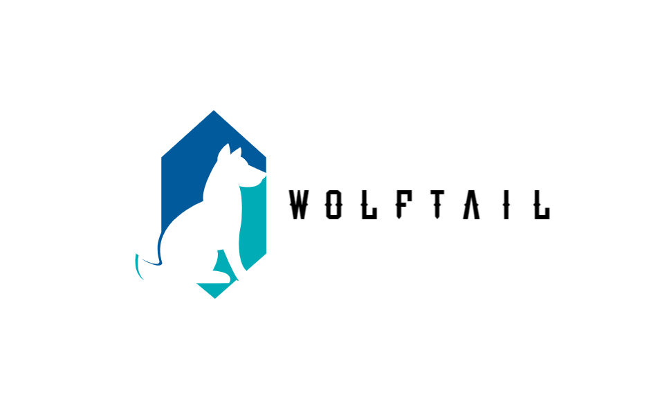

**Wolftail** is a minecraft lib mod specifically designed for developing race different hugely from the race "steve". It currently contains three modules:
1. (Core) Login the server as universal player
2. (Renderer) Render normal game UI etc.
3. (Tracker) Track data in server

### TODOs

There are still loads of things haven't done yet.
1. Tracker can't track entities in server
2. There should be a "race list" in main menu
3. Race determine method
4. Make an example mod

### How to contribute

Clone the default branch and run gradle in command line, just as how you develope a normal forge mod.
